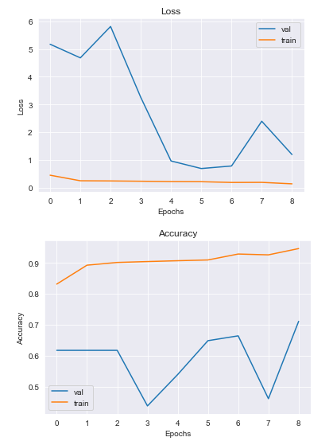

# X-Ray Images Analysis for Pneumonia in Pediatric Patients
Author: Tosca Le


## Overview

This project explores a dataset of x-ray images from pediatric patients with/without pneumonia. Pneumonia is a very common inflammatory condition that is found in the lungs, primarily in the air sacs when filled with fluid or pus. 

The images in the dataset were selected from cohorts of patients from one to five years old from Guangzhou Women and Children's Medical Center. The data was provided by Kermany et al. on Mendeley through Kaggle datasets. All the chest x-ray images were screened for quality control, and then the diagnoses of the images were graded by two expert physicians before cleared for training. This project outlines the implementation of neural networks and how it can help classify whether or not a given patient has pneumonia, given a chest x-ray image.
***

## Business Problem

The Children's Medical Center has asked for assistance on exploring whether partially automating the diagnosis of pneumonia in their pediatric patients is possible. Rather than finding the best possible accuracy on a model, a deep neural network that has been clearly iterated on can help our understanding of how these models and automations work and if it can help doctors confidently and efficiently diagnosis pneumonia. Broadly speaking, this can also help our understanding of AI learning and its implementation in the medical field. The Children's Medical Center hopes to gain more understanding of supervised learning and it's potential use case in diagnosis.

***

## Data

The data was organized into three folders: train, test, and val. Each folder contains sub-folders labeled as two categories, normal and pneumonia. Within the train set there are 5216 images between the two classes, 624 in test and only 16 images in val. To better balance the validation set, I randomly selected images from the test folder and moved them to the respective class within val. 

***


## Methods

This project analyzes and compares neural network models based on whether or not the patient has pneumonia or not. The goal is to demonstrate an understanding of a working model. With the dataset being quite large, only training on a portion of the dataset will allow me to run models in a reasonable time. Accuracy was used as the evaluation metric and in the evaluation, other metrics such as recall are examined.

***


## Results

The baseline shows that it is likely overfit to the training data. Additionally, the validation scores jump around much more than the training on the learning curves.


After iterating through a shallow basic CNN model, the two had similar accuracy scores and recall. The shallow CNN had a slightly better recall score and optimized more false positives.


The last iteration, a ResNet50 model had worse accuracy scores than the previous iterations. However, it had a greater recall score and more false positives compared to false negatives. 




***


## Conclusions
Due to the nature of this business problem, it is fairly safe to assume that it would be better to have more false positives rather than false negatives. In other words, a positive diagnosis of pneumonia when the patients ultimately did not have pneumonia can potentially be worse then a patient who does have pneumonia is diagnosed as negative or "normal".

Even though the ResNet50 model had a similar accuracy to the baseline at 0.73, it had the highest recall score and false positives. Overall, as seen through each iteration, by adding more layers and in return, adding more complexity, the weights in the network increase and are able to extract more features. However, adding more layers isn't always the answer. It is heavily dependent on the data. With more tuning, there would probably be a better performing model.

Overall, it is possible to utilize AI in helping our understanding of classification, and I know it will continue to grow in the health and medical space. As more and more data is available, and deeper models such as ResNet can be tuned to learn more efficiently, it will only increase performance and proper diagnosis. This increased understanding can help medical personnel in not only efficiency but parameters of diagnosis such as patterns we may not be able to notice. This can also help broaden our scope to other sectors of help.


***

### Next Steps

* There are many parameters that could've been tuned or incorporated in the preprocessing steps and models. Our understanding of these additional iterations can continue to inform the use case and business problem.
* The x-rays in this dataset were of pediatric patients. It would be interesting to see how this process and these models would perform with a different dataset or a more diverse dataset such as including adults.


***

## For More Information

Please review my full analysis in my [Jupyter Notebook](./pneumonia_xray_analysis.ipynb) or [presentation](./pneumonia_xray_analysis_presentation.pdf).

The data for this analysis was provided by [Kermany et al.](https://data.mendeley.com/datasets/rscbjbr9sj/2) through the courtesy of [Kaggle](https://www.kaggle.com/paultimothymooney/chest-xray-pneumonia). 

For any additional questions, please contact me at **toscatle@gmail.com**.

***

## Repository Structure

```
├── images
├── .gitignore
├── LICENSE                          
├── README.md 
├── data_split.ipynb  
├── pneumonia_xray_analysis.ipynb                                  
└── pneumonia_xray_analysis_presentation.pdf                               
```
